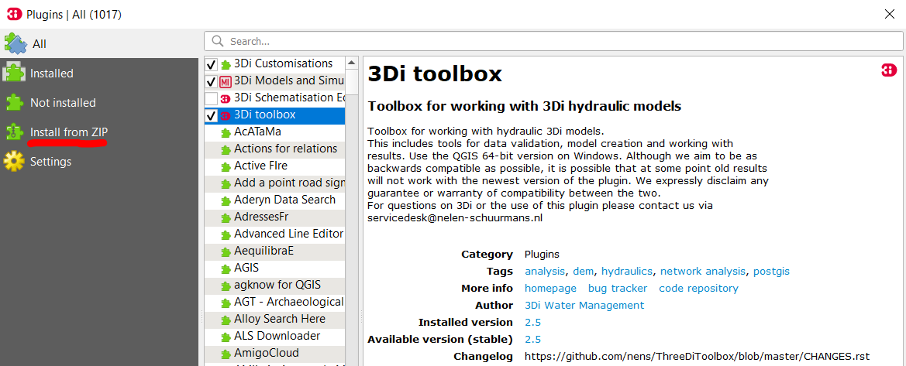

# Installatie instructies

1. [Vereisten](#vereisten)
2. [Python depencendies installeren](#osgeo4w_install)
3. [Plugin installatie](#plugin_installatie)

<a id="vereisten"></a>

## Vereisten
De HHNK toolbox heeft de volgende (systeem) vereisten:

### QGIS version:
Plugin is compatibel met QGIS version 3.10 en hoger

### Python packages
De plugin maakt gebruik van de volgende Python packages:

```
  GDAL~=3.1.4
  matplotlib~=3.1.3
  numpy~=1.19.1
  geopandas~=0.7.0
  rtree~=0.9.7
  pandas~=1.0.1
  Shapely~=1.7.0
  threedigrid~=1.1.1
  ogr~=0.24.1
  PyQt5~=5.11.3
  hhnk_threedi_tests
```


<a id="osgeo4w_install"></a>

## Python depencendies installeren (OSGeo4W)

### Installatie dependencies met ```OSGeo4W intaller```

Als je ```QGIS``` hebt geinstalleerd met de ```OSGeo4W``` distributie, dan is het verstandig om de benodigde packages 
via de installer te installeren. Deze handleiding gaat uit van een bestaande of nieuwe installatie waarin alleen 
```QGIS Desktop``` is geselecteerd onder de ```Desktop``` tab om een zo volledig mogelijk overzicht te geven:


Open de installer and selecteer 'Advanced Install':


Selecteer 'install from internet':


Het volgende scherm ziet er als volgt uit:


Check of het pad naar de OSGeo4W installatie klopt. Bepaal of je de installatie alleen voor de huidige gebruiker of 
voor alle gebruikers wil uitvoeren.

Klik 'next' totdat je het volgende scherm bereik en selecteer een 'connection type':


(Alleen als je in het vorige scherm 'Direct Connection' hebt geselecteerd)
Selecteer een site waar de packages vandaan zullen worden gedownload (of vul handmatig een url in):


Klik volgende:


**BELANGRIJK**: Zorg dat 'Keep' is geselecteerd bovenin rechts (de andere opties zijn 'Curr', 'Prev' en 'Exp') als de 
standaard optie. Zorg dat de eerste bovenste rij in het middelste veld ('All ) op 
'Default staat'. Je kunt de setting aanpassen door op het icoon naast 'All' te klikken.

Open de 'Libs' tab

Zoek de volgende packages om te installeren:
```
    python3-geopandas   (>= 0.7.0)
    python3-pandas      (>= 1.0.1)
    python3-matplotlib  (>= 3.1.3)
    python3-pip         (versie maakt niet uit)
    
    Als je niet van plan bent om de 3diToolbox ook te installeren (als je dat wel van plan bent, 
    sla deze package dan over):
    
    python3-h5py        (2.10.0)
```
Voorbeeld:


Click op de 'mode' knop () totdat een installatie is geselecteerd (dit is te zien aan 
het feit dat er een versie staat)

Klik volgende. Er wordt je nu gevraagd een aantal dependencies te installeren waaronder een aantal packages die nodig 
zijn voor deze plugin:

```
    gdal/ogr        (3.1.4)     Nodig voor ```QGIS``` installatie
    numpy           (1.19.1)    Nodig voor ```QGIS``` installatie
    PyQt5           (5.11.3)    Nodig voor ```QGIS``` installatie
    sqlite3                     Nodig voor ```QGIS``` installatie
    setuptools      (45.2.0)    Nodig voor ```matplotlib``` installatie
    Shapely         (1.7.0)     Nodig voor ```geopandas``` installatie
    fiona           (1.8.10)    Nodig voor ```geopandas``` installatie
```

### Installatie dependencies met ```OSGeo4W``` command prompt

Ga naar de map waar ```OSGeo4W``` is geinstalleerd


Open de OSGeo4W command prompt (zorg dat je de juiste rechten hebt, het kan zijn dat je de prompt als Administrator moet
openen)

In de command prompt navigeer je naar de map van je OSGeo4W installatie door het volgende commando in te typen:

```cd [path_to_osgeo4w_installation]``` (laat de blokhaken weg)

Type het volgende commando en druk op 'Enter':

```call bin\py3_env.bat```

Dit activeert de Python omgeving die deel uitmaakt van je ```OSGeo4W``` installatie. Je kunt checken of dit gewerkt 
heeft door ```set``` in de command prompt te typen. Controleer dat ```PYTHONPATH``` en ```PYTHONHOME``` verwijzen naar 
de juiste paden (in de OSGeo4W map).

Als je niet van plan bent om de ```3di Toolbox``` te installeren, type je het volgende commando in de command prompt 
en klik 'Enter':

```pip install threedigrid```

Als je van plan bent om de ```3di Toolbox``` te installeren kun je dat het best nu doen. Wanneer je klaar bent met 
die installatie of je de ```3di Toolbox``` niet wilt installeren type je het volgende in de ```OSGeo4W command prompt```:

```pip install hhnk_threedi_tests``` (installeert ook automatisch hhnk_research_tools)

TODO
```pip install -i --upgrade https://test.pypi.org/simple/ hhnk-threedi-tests``` (deze plugin staat nog op de testpypi, bij eerste installatie de --upgrade weglaten)

Dit werkt niet helemaal omdat via de cmd de python pakketen die onder `C:\OSGeo4W64\apps\qgis-ltr\python` staan niet in het pad zijn opgenomen. Daarom nu gebruikt gemaakt van een .bat file die deze paden goed zet. TODO; bat-file opnemen in documentatie.

Installatie werkt niet helemaal omdat github en pip een andere naam hebben hhnk_research_tools_py vs hhnk_research_tools. Fixen door:
```
pip uninstall hhnk_research_tools
pip install hhnk-research-tools
```


Je bent nu klaar om de plugin in ```QGIS``` te installeren!

<a id="plugin_installatie"></a>

## De plugin installeren

Om de plugin te installeren open je ```QGIS``` en navigeer je naar ```plugins > manage and install plugins```:



Dit opent de plugin manager. Klik op ```install from ZIP```, selecteer de ```.zip``` file van de plugin en klik op 
'Install Plugin'. De plugin is nu geinstalleerd in ```QGIS```. 

Als dit niet werkt kun je de zip file ook direct uitpakken in de ```QGIS``` plugin map. Dit pad ziet er als volgt uit:

```C:\Users\[gebruiker]\AppData\Roaming\QGIS\QGIS3\profiles\default\python\plugins``` (waar gebruiker de naam van de 
gebruiker voor wie je de plugin installeert is)


Om de plugin te activeren klik je (in hetzelfde scherm als in de vorige stap) op 'Installed'. Zoek de HHNK_toolbox in 
de lijst en zorg dat deze is aangevinkt.

Je kunt de plugin manager nu afsluiten.


De plugin is nu te vinden in de toolbar en in het menu onder 'Plugins'. De plugin is nu klaar voor gebruik!
